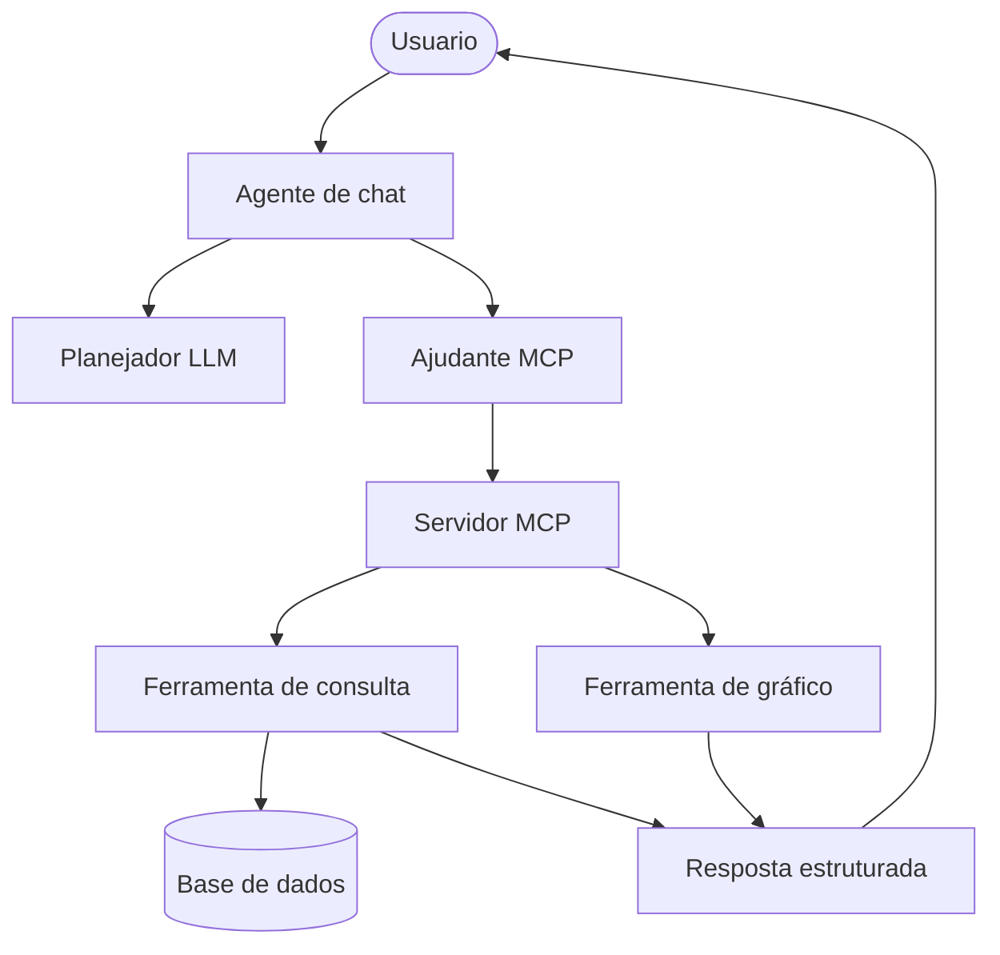

# REFATORACAO_MCP

Aplicação independente baseada em agente de chat, com interface Streamlit e servidor MCP local.

## Objetivo

- Chat do usuário em Streamlit
- Pergunta enviada diretamente para o agente de chat
- O agente aplica regras de segurança, usa LLM para planejar chamadas e consulta o servidor MCP local
- Ferramentas registradas no MCP:
  - ferramenta de consulta: busca dados de arrecadação
  - ferramenta de gráfico: gera resposta estruturada com gráfico Plotly
- Quando a pergunta estiver fora de escopo, retorna orientação ao usuário
- Histórico de diálogo persistido em sessão Streamlit

## Arquitetura da aplicação

A aplicação segue um modelo orientado a agentes com separação clara de responsabilidades:

1. Camada de apresentação
- Exibe o chat, histórico e resultados (mensagem, SQL, dados e gráfico).
- Envia a pergunta diretamente para o agente de chat.
- O código da interface fica em `app/presentation/chat_interface.py`.

2. Camada de orquestração
- O agente de chat concentra o planejador, as regras de segurança, os contratos internos e o resumo textual.
- O ajudante MCP em stdio abre a sessão com o servidor local.
- O servidor MCP registra apenas consulta e gráfico.

3. Camada de execução
- A ferramenta de consulta executa a busca estruturada no Redshift com SQL parametrizado.
- A ferramenta de gráfico transforma o resultado tabular em gráfico Plotly.

4. Camada de infraestrutura
- O cliente do Redshift conecta ao banco via `pg8000`.
- O provedor de catálogos auxiliares oferece segmentos e subgrupos.

5. Camada compartilhada
- Os contratos compartilhados definem a estrutura de entrada e saída dos dados.

Fluxo ponta a ponta:

`Usuário -> Streamlit -> agente de chat -> planejador LLM -> ajudante MCP -> servidor MCP -> ferramentas de consulta e gráfico -> Streamlit`



Com isso, a aplicação evita respostas livres fora de escopo e sempre responde a partir de ferramentas registradas.

## Estrutura

- `streamlit_app.py`: inicializador da interface na raiz
- `app/presentation/chat_interface.py`: interface de chat com histórico
- `app/execution/chat_agent/chat_agent.py`: orquestração da resposta
- `app/execution/chat_agent/guardrail_policy.py`: validação de escopo
- `app/execution/chat_agent/llm_planner.py`: tradução de linguagem natural para uma sequência de chamadas de ferramenta
- `app/execution/chat_agent/summary_builder.py`: resumo textual de resposta
- `app/execution/tools/tool_registry.py`: catálogo e registro das ferramentas
- `app/execution/mcp_server.py`: registro das ferramentas no servidor MCP
- `app/execution/mcp_stdio_helper.py`: ajudante MCP local em stdio
- `app/shared/contracts.py`: contratos de entrada e saída
- `app/execution/query_tool.py`: construção e execução SQL controlado
- `app/execution/chart_tool.py`: geração de gráfico Plotly
- `app/infrastructure/redshift_client.py`: acesso ao Redshift
- `app/infrastructure/catalog_provider.py`: catálogos auxiliares
- `app/config/guardrails_policy.json`: política externa de segurança

## Setup

1. Criar ambiente Python e instalar dependencias:

```bash
pip install -r requirements.txt
```

Observação: este projeto usa `pg8000` (driver Python puro) para conexão com Redshift,
evitando build de dependências nativas como `lxml` em ambientes Windows/proxy.

2. Criar `.env` com base em `.env.example`.

3. Configurar credenciais do Redshift e chave de LLM.

Importante: como o planejamento é feito integralmente por LLM, `OPENAI_API_KEY` é obrigatória.

## Execução

No diretório `REFATORACAO_MCP`:

```bash
streamlit run streamlit_app.py
```

A cada pergunta, o agente de chat abre uma sessão MCP local via stdio para chamar a ferramenta de consulta e a ferramenta de gráfico.

## Guardrails

Se a pergunta não puder ser traduzida para chamadas válidas de ferramentas, o sistema não inventa resposta livre.
Ele retorna mensagem de orientação com exemplos de perguntas suportadas.
