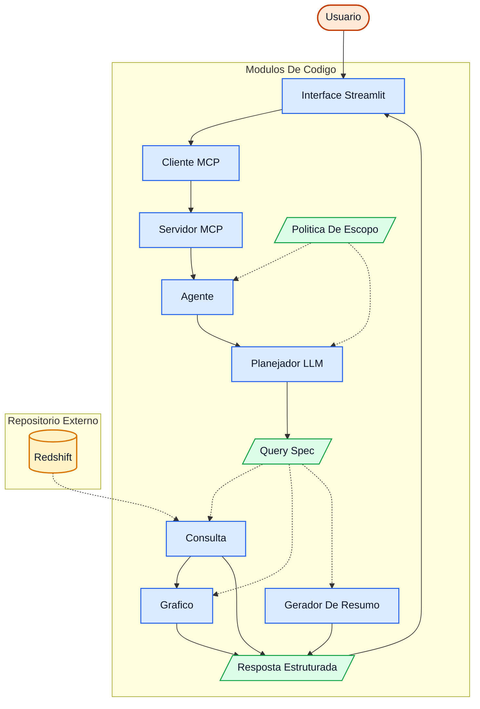

# REFATORACAO_MCP

Aplicacao independente baseada em agentes, com interface Streamlit e servidor MCP local.

## Objetivo

- Chat do usuario em Streamlit
- Pergunta enviada para servidor MCP local
- Servidor aplica guardrails e usa LLM para planejar chamada de tools
- Tools registradas no MCP:
  - `query_tool`: consulta dados de arrecadacao
  - `chart_tool`: gera resposta estruturada com grafico Plotly
- Quando a pergunta estiver fora de escopo, retorna orientacao ao usuario
- Historico de dialogo persistido em sessao Streamlit

## Arquitetura da aplicacao

A aplicacao segue um modelo orientado a agentes com MCP local e separacao clara de responsabilidades:

1. Camada de Presentation (Streamlit)
- Exibe o chat, historico e resultados (mensagem, SQL, dados e grafico).
- Envia a pergunta para o cliente MCP local.
- O codigo da interface fica em `app/presentation/streamlit_app.py`.

- 2. Camada de Orchestration
- `app/execution/mcp_client.py` abre uma sessao MCP via stdio.
- `app/execution/mcp_server.py` registra as tools e recebe chamadas do cliente.

3. Camada de Orchestration do Agente
- `app/execution/tools/agent_tool/agent_tool.py` coordena o fluxo de resposta.
- `app/execution/tools/agent_tool/guardrail_policy.py` carrega a politica de escopo a partir de arquivo externo.
- `app/config/guardrails_policy.json` concentra as regras de dominio e mensagem de orientacao.
- `app/execution/tools/agent_tool/llm_planner.py` converte linguagem natural em uma sequência de `tool_calls` usando LLM, com catálogo de tools como contexto.
- `app/execution/tools/agent_tool/dtos.py` concentra os DTOs internos do agente (`AgentPlan`, `AgentResponse` e `ToolCall`).
- `app/execution/tools/tool_registry.py` define o catálogo de tools registradas no servidor MCP e serve de base para validação de capacidade.
- O planner considera historico recente da conversa para continuidade de contexto.
- Quando a LLM retorna JSON invalido, o planner executa tentativas de correcao automatica antes de negar a pergunta.
- `app/execution/tools/agent_tool/summary_builder.py` gera o resumo textual da resposta com base no `QuerySpec`.

4. Camada de Execution
- `app/execution/query_tool.py`: executa consulta estruturada no Redshift com SQL parametrizado (bind variables).
- `app/execution/chart_tool.py`: transforma o resultado tabular em grafico Plotly (JSON).

5. Camada de Infrastructure
- `app/infrastructure/redshift_client.py` conecta ao Redshift via `pg8000` (driver Python puro).
- `app/infrastructure/catalog_provider.py` fornece catalogos auxiliares (segmentos/subgrupos).

6. Camada Shared
- `app/shared/contracts.py` define os contratos realmente compartilhados entre as camadas, como `QuerySpec`.

Fluxo ponta a ponta:

`Usuario -> Streamlit -> MCP Client -> MCP Server (agent_tool) -> Guardrails -> Planner LLM -> tool_calls planejados com base no catálogo -> execução sequencial das tools -> Streamlit`



Com isso, a aplicacao evita respostas livres fora de escopo e sempre responde a partir de ferramentas registradas.

## Estrutura

- `streamlit_app.py`: launcher raiz da interface
- `app/presentation/streamlit_app.py`: interface de chat com historico
- `app/execution/tools/agent_tool/agent_tool.py`: orquestracao da resposta
- `app/execution/tools/agent_tool/guardrail_policy.py`: validacao de escopo
- `app/execution/tools/agent_tool/llm_planner.py`: traducao de linguagem natural para uma sequência de tool_calls
- `app/execution/tools/agent_tool/summary_builder.py`: resumo textual de resposta a partir do QuerySpec
- `app/execution/tools/tool_registry.py`: catálogo e registro das tools registradas
- `app/execution/mcp_server.py`: registro das tools MCP
- `app/execution/mcp_client.py`: cliente MCP local (stdio)
- `app/shared/contracts.py`: contratos de entrada/saida
- `app/execution/query_tool.py`: construcao e execucao SQL controlado
- `app/execution/chart_tool.py`: geracao de grafico Plotly
- `app/infrastructure/redshift_client.py`: acesso ao Redshift
- `app/infrastructure/catalog_provider.py`: catalogos auxiliares
- `app/config/guardrails_policy.json`: politica externa de guardrails

## Setup

1. Criar ambiente Python e instalar dependencias:

```bash
pip install -r requirements.txt
```

Observacao: este projeto usa `pg8000` (driver Python puro) para conexao com Redshift,
evitando build de dependencias nativas como `lxml` em ambientes Windows/proxy.

2. Criar `.env` com base em `.env.example`.

3. Configurar credenciais do Redshift e chave de LLM.

Importante: como o planejamento e feito integralmente por LLM, `OPENAI_API_KEY` e obrigatoria.

## Execucao

No diretorio `REFATORACAO_MCP`:

```bash
streamlit run streamlit_app.py
```

A cada pergunta, o app abre uma sessao MCP local via stdio para chamar a tool `agent_tool`.

## Guardrails

Se a pergunta nao puder ser traduzida para chamadas validas de tools, o sistema nao inventa resposta livre.
Ele retorna mensagem de orientacao com exemplos de perguntas suportadas.
